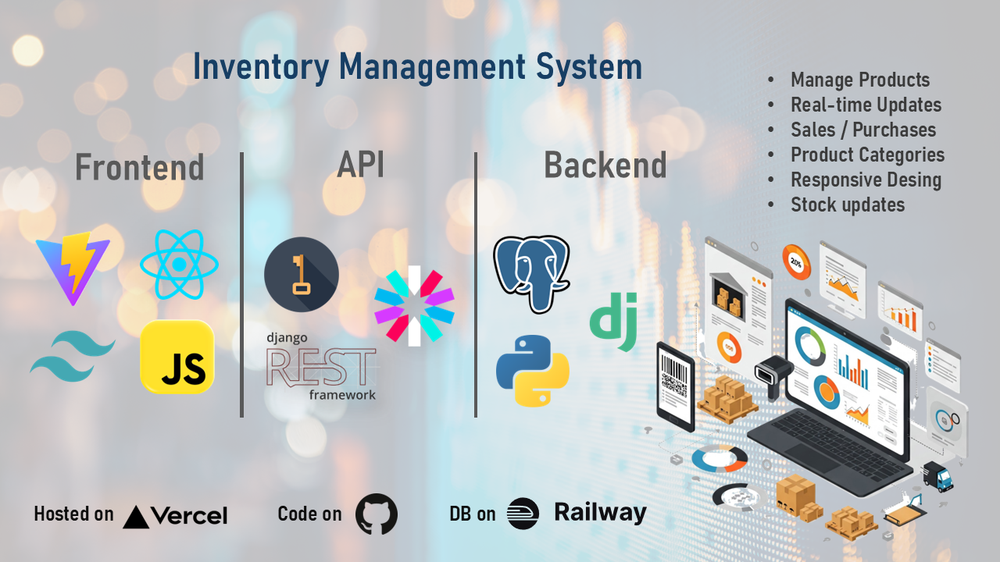

[](#)
[](#)
[](#)
[](#)
[](#)
[](#)

# 🚀 Inventory Management System

A full-stack Inventory Management System with **User Authentication** and **Authorization**. Built with **Django REST Framework** for the backend and **Vite + React + Tailwind CSS** for the frontend. Fully _**Optimized Code**_ with _**Responsive Seding**_.



## ✨ Features

### User Authentication

- 👤 Register: Create a new user account.
- 🔑 Login: Authenticate and access the system.
- 🚪 Logout: Securely log out of the system.

### 📦 Product Management

- ✅ Add, Update, List, Delete products
- 🏷️ Product Categories (Organize products efficiently)
- 📊 Stock Tracking (Keep an eye on inventory levels)

### Authorization

- 🔒 Only the author of a product can edit or delete it.

### 👥 Customer & Supplier Management

- 👤 Customers (Track customer details & purchase history)
- Suppliers (Manage suppliers & procurement details)

### 💰 Sales & Purchases

- 🛒 Sales (Record customer orders & transactions)
- 🛒 Purchases (Track supplier orders & inventory restocking)

## 🛠️ Tech Stack

### Backend

- 🐍 **Python:** Programming language.
- 🎯 **Django:** Web framework.
- 🔄 **Django REST Framework (DRF):** For building RESTful APIs.
- 🔐 **JWT Authentication:** Secure user authentication.

### Frontend

- ⚡ **Vite:** Fast build tool for React.
- ⚛️ **React:** JavaScript library for building user interfaces.
- 🎨 **Tailwind CSS:** Utility-first CSS framework for styling.
- 🔄 **Axios:** For making HTTP requests to the backend.

## 🚀 Getting Started

### Prerequisites

- Python 3.x
- Node.js
- npm or yarn

## Backend Setup

1. Clone the repository:

```bash
git clone https://github.com/kevinThulnith/django-vite-react-tailwind-project.git
```

2. Create a virtual environment:

```bash
python -m venv venv
source venv/bin/activate  # On Windows: .\venv\Scripts\activate
```

3. Install dependencies:

- install postgressSQL and c++ buid tool first.

```bash
pip install -r requirements.txt
```

4. Run migrations:

```bash
python manage.py migrate
```

5. Start the Django development server:

```bash
python manage.py runserver
```

➡️ Backend runs at `http://localhost:8000`

## Frontend Setup

1. Navigate to the frontend directory:

```bash
cd ../frontend
```

2. Install dependencies:

```bash
npm i
```

3. Start the Vite development server:

```bash
npm run dev
```

➡️ Frontend runs at `http://localhost:3000`

## To Host on Local Network

1. Get device **Ip** address

```bash
ipconfig getifaddr en0 // in windows ipconfig
```

2. Start bachend

```bash
py .\manage.py runserver <Device Ip address>:8000
```

3. Start frontend

   - change **.env** file fist

```bash
npx vite --host {Device Ip Address}
```

## **Configuration:** ⚙️

- **Database:** Configure your database settings in `backend/inventory/settings.py`. You can use SQLite (default, good for development) or PostgreSQL, MySQL, etc. for production.
- **Environment Variables:** Consider using environment variables (e.g., using `python-dotenv`) for sensitive information like secret keys and database credentials. _Don't commit these to your repository!_ 🤫
- **API Base URL:** Update the API base URL in your frontend React components to point to your Django backend (usually `http://localhost:8000`).

<br>

## 📂 Project Structure

```bash
📦 inventory-management-system
├── 📂 backend             # Django REST API
│   ├── 📂 core            # Main app (settings, models, views)
│   ├── 📂 products        # Product & Category logic
│   ├── 📂 customers       # Customer management
│   ├── 📂 suppliers       # Supplier management
│   ├── 📂 sales           # Sales tracking
│   └── 📂 purchases       # Purchase tracking
│
├── 📂 frontend            # React Frontend
│   ├── 📂 src
│   │   ├── 📂 components  # Reusable UI components
│   │   ├── 📂 pages       # Page components
│   │   ├── 📂 hooks       # Custom React hooks
│   │   └── 📂 api        # API service functions
│   └── vite.config.js     # Vite configuration
│
└── 📜 README.md           # You're here!
```

## 🔐 Authentication Flow

- Register `api/user/register/` : Users can create an account by providing their details.
- Login `api/token/` : Users log in with their credentials and receive an authentication token.
- Protected Routes: Only authenticated users can access product management features.
- Logout `api/token/blacklist/` : Users can log out, and their token is invalidated.

## 🔗 API Endpoints:

The backend provides a RESTful API using Django REST Framework. You can access the API documentation at `http://localhost:8000/api/` (or the correct port for your development server) after running the Django server. Example endpoints:

- `/api/categories/` (GET, POST, PUT, DELETE)
- `/api/customers/` (GET, POST, PUT, DELETE)
- `/api/suppliers/` (GET, POST, PUT, DELETE)
- `/api/products/` (GET, POST, PUT, DELETE)
- `/api/sales/` (GET, POST, PUT, DELETE)
- `/api/purchases/` (GET, POST, PUT, DELETE)
- `/api/token/` (POST) - Obtain JWT token
- `/api/token/refresh/` (POST) - Refresh JWT token

## 🌟 Why This Project?

- ✔ Modern Stack – Combines Django’s robustness with React’s flexibility.
- ✔ Scalable – Modular backend & reusable frontend components.
- ✔ Responsive UI – Tailwind CSS ensures a sleek experience.
- ✔ RESTful API – Clean, well-structured endpoints.

## 🤝 Contributing

PRs are welcome!

- Fork the repo
- Create a branch (`git checkout -b feature/awesome-feature`)
- Commit changes (`git commit -m "Add awesome feature"`)
- Push (`git push origin feature/awesome-feature`)
- Open a PR

## Show Your Support: ❤️

If you find `Inventory Management System` helpful, please consider:

- Starring the repository on GitHub! ⭐
- Sharing it with your network.
- Contributing to the project.

Happy Coding! 🎉👨‍💻👩‍💻
